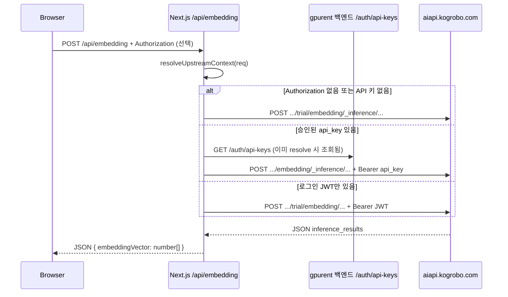

# Embedding API 연동 (`/api/embedding`)

브라우저는 **동일 오리진** `POST /api/embedding` 만 호출하고, Next.js Route Handler가 **AI API 게이트웨이**(`aiapi.kogrobo.com:11115`)로 프록시합니다.  
구현: `src/app/api/embedding/route.ts`

---

## 요청 흐름



---

## 업스트림 URL · trial 분기

`resolveUpstreamContext` (`src/app/api/_lib/upstream.ts`)로 베이스 경로를 정합니다.

| 조건 | `upstreamBasePath` | 최종 POST URL |
|------|-------------------|---------------|
| `Authorization` 없음 | `http://aiapi.kogrobo.com:11115/trial` | `.../trial/embedding/_inference/text_embedding/qwen3` |
| 토큰은 있으나 API 키 조회 실패·키 없음 | `.../trial` | 동일 |
| 승인된 `api_key` 문자열 있음 | `http://aiapi.kogrobo.com:11115` | `.../embedding/_inference/text_embedding/qwen3` |

고정 inference 경로(추론 ID 없음):

```
{upstreamBasePath}/embedding/_inference/text_embedding/qwen3
```

---

## 인증 헤더

업스트림 `fetch` 시:

1. **API 키 있음** → `Authorization: Bearer {apiKey}`
2. **키 없고 브라우저 JWT 있음** → `Authorization: {authHeader}` (클라이언트가 보낸 `Bearer …` 그대로)
3. **둘 다 없음** → 인증 헤더 없음 (trial 경로)

```typescript
...(apiKey
  ? { Authorization: `Bearer ${apiKey}` }
  : authHeader
    ? { Authorization: authHeader }
    : {}),
```

---

## 클라이언트 → Next 요청

**메서드:** `POST`  
**경로:** `/api/embedding`  
**헤더:** `Content-Type: application/json`, 선택 `Authorization: Bearer <access_token>`

**Body (둘 중 하나로 텍스트 전달):**

| 필드 | 설명 |
|------|------|
| `text` | Playground에서 주로 사용 |
| `input` | Developer Console 스펙과 동일 |
| `input_type` | 선택, 기본 `"string"` |

예:

```json
{
  "text": "임베딩할 문장"
}
```

또는

```json
{
  "input": "임베딩할 문장",
  "input_type": "string"
}
```

`text` / `input` 모두 비어 있으면 **400** `{ "error": "input/text를 확인해주세요." }`

---

## Next → 업스트림 요청

**Body (항상 이 형태로 변환):**

```json
{
  "input": "<정규화된 텍스트>",
  "task_settings": { "additionalProp1": {} },
  "input_type": "<input_type 또는 string>"
}
```

**타임아웃:** `AbortSignal.timeout(120_000)` (120초)

---

## 응답

### 성공 (200)

업스트림 JSON에서 다음 경로를 읽습니다:

```
inference_results[0].text_embedding  →  number[]
```

Next는 숫자 배열로 정규화한 뒤 클라이언트에 전달합니다.

```json
{
  "embeddingVector": [0.0123, -0.0456, ...]
}
```

- `typeof v === "number"` 가 아니면 `Number(v)` 시도
- `Number.isFinite` 가 아닌 값은 제거

### 업스트림 오류

| 상태 | 클라이언트 메시지 |
|------|------------------|
| 429 | 일일 체험 한도 초과 (한국어 고정 문구) |
| 기타 | 업스트림 `error` 또는 `"Embedding API 요청 실패"` |

### 형식 오류 (502)

`text_embedding` 이 배열이 아니면:

```json
{ "error": "Embedding 응답 형식이 올바르지 않습니다." }
```

### 연결 실패 (500)

```json
{ "error": "Embedding 서버 연결에 실패했습니다." }
```

---

## 관련 파일

| 파일 | 역할 |
|------|------|
| `src/app/api/embedding/route.ts` | 프록시·정규화 |
| `src/app/api/_lib/upstream.ts` | trial / apiKey 분기 |
| `src/app/api/_lib/backend.ts` | `/auth/api-keys` 조회 (`INTERNAL_API_URL`) |
| `src/app/docs/page.tsx` | 공개 API 문서 섹션 (별도 스펙 설명) |

---

## 참고

- 예전 `EMBEDDING_API_KEY` 환경 변수 방식은 코드에서 주석 처리되어 있으며, 현재는 **사용자 API 키 + JWT 폴백 + trial** 패턴을 사용합니다.
- Rerank API(`src/app/api/rerank/route.ts`)와 달리 Embedding은 **JWT 폴백**이 있어, 로그인만 한 상태에서도 업스트림에 Bearer가 전달될 수 있습니다.
